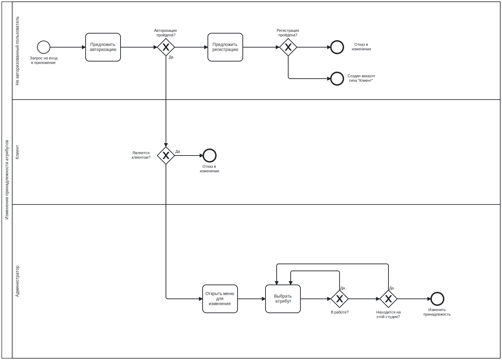

# Web
## Лабораторная работа №1
### Название проекта
Приложение бронирования студий.
### Краткое описание идеи проекта
В нышнее время информационные технологии быстро развиваются и, как следствие, связанные с ними сферы деятельности, в том числе и музыкальные. Идеей проекта является создание приложения для удаленной записи в студийные комнаты. В рамках данного проекта планируется разработать ПО для работы с базой данных, содержащей информацию об пользователях; студиях; об их оборудовании, комнатах с доступным временем, инструменталистах с доступным временем, звукорежиссерах с доступным временем;

### Краткое описание предметной области
В рамках данного проекта предметной областью явлеется сеть студий, в каждой из которых находится a-ое количество комнат, b-ое количество оборудования, c-ое количество звукорежиссеров, d-ое количество инструменталистов. Клиент имеет возможность выбрать студию и свободный промежуток времени любой комнаты, выбрав также (по желанию) оборудование и с учетом выбранного времени звукорежиссера и инструменталиста.

### Функциональные требования
1. Приложение должно иметь ролевую модель.
2. Приложение должно позволять создавать брони на доступные атрибуты с учетом введенного времени.
3. Приложение должно повзолять изменять, удалять и создавать новые атрибуты

### Краткий анализ аналогичных решений
Каждая студийная компания пользуется собственной непубличной разработкой, поэтому анализ аналогичных решений провести не удалось 

### Краткое описание акторов (ролей)
|Роль|Описание|
|:-:|:-:|
|Неавторизованный пользователь|Не имеет никаких возможностей, кроме регистрации, авторизации|
|Клиент|Имеет право смотреть свои брони, создавать новые и отменять|
|Администратор|Добавлять, изменять и удалять студии и их атрибуты|

### ER-диаграмма сущностей

### Use-case диаграмма

### Формализация ключевых бизнес-процессов
#### Создание брони

#### Добавление атрибута

#### Изменить привязанность

### Верхнеуровневое разбиение на компоненты

<!-- ### Диаграмма классов

 -->

### Сложные сценарии
|Сценарий|Описание|
|:-:|:-:|
|Бронирование|Во время бронирования вероятность возникновения конфликтов между временем комнаты, со звукорежиссером и инструменталистом. Помимо этого нужно, чтобы комната, оборудование, звукорежиссер и инструменталист были привязаны к одной студии. Необходимо для каждого сотрудника, привязанного к данной студии, определить его свободное оставшееся время. В случае, если есть подходящий отрезок времени, то этот сотрудник предлагается пользователю.|

#### Граничные случаи

- У всех комнат студии занято время;
- У комнаты есть время, но оборудование не привязано к студии;
- У комнаты есть время, но все оборудование занято;
- У комнаты есть время, но частично оборудование занято;
- У комнаты есть время, но оборудование не требуется;
- У комнаты есть время, оборудование выбрано, но не привязан ни один сотрудник;
- У комнаты есть время, оборудование выбрано, но один сотрудник привязан, а другой нет;
- У комнаты есть время, оборудование выбрано, но все доступные сотрудники заняты;
- У комнаты есть время, оборудование выбрано, но один сотрудник доступен, а другой нет;
- У комнаты есть время, оборудование выбрано, но свбодное время сотрудника/сотрудников не сходится с выбранным временем;
- У комнаты есть время, оборудоване выбрано, но сотрудники не требуются;
- У комнаты есть время, оборудование и сотрудники выбраны.

### Пользовательские сценарии (не менее 3 типовых сценариев, в текстовом виде, расписанных по шагам, для разных акторов)
1. Навторизованный пользователь жмет кнопку регистрации -- повляется форма для заполнения -- пользователь заполняет все поля -- если поля заполнены верно, то создается новый профиль.

2. Клиент жмет кнопку на сайте для выбора студии -- появляются комнаты -- жмет на комнаты -- выбирает доступное время -- выбирает (или нет) аппаратуру -- выбирает (или нет) звукорежиссера -- выбирает (или нет) инструменталиста -- создает бронь.

3. Администратор нажимает на студию -- открывает список привязанных сотрудников и оборудования -- изменяет свойства.

### Экраны будущего приложения
#### Регистрация

#### Авторизация

#### Создать бронь

#### Проверить свои брони

#### Удалить бронь

#### Панель админа

